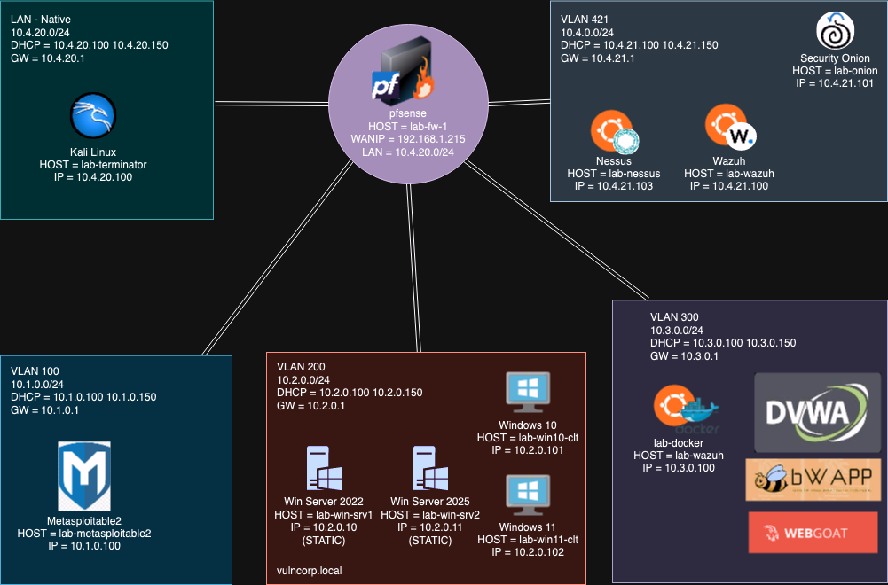

# hackbox-lab

A cyber security lab hosted in Proxmox VE

This repo was inpired by @gerardobrien's "Ultimate Cybersecurity Lab" series. This is my take on his concept. 

On this topology, I decided to segretate the SIEM tools from the Kali workbench. Also, I used a differnt ip schema and added an additional widows 2025 server image to thee mix. 

# Prerequisites 

 - A freshly brewed cup of patience to get through the build.
 - Operating systems used in this sandbox (Windows 2022 Server, Windows 10, 11 Client, Ubuntu 22.04 LTS, Kali Linux)
 - Proxmox VE 8.1.5 (Fresh install)
 - Hardware used: 1 Dell Latitude 5500 laptop - 1tb ssd - 32 gb RAM

# Build Links

The following are links for elements needed to standd up each node. 

## Docker

- https://docs.docker.com/engine/install/ubuntu/
- https://docs.portainer.io/start/install-ce/server/docker/linux

## Docker Images

- bwapp - https://hub.docker.com/r/raesene/bwapp
- dvwa - https://hub.docker.com/r/vulnerables/web-dvwa/
- webgoat - https://hub.docker.com/r/webgoat/webgoat

## Wazuh

- https://documentation.wazuh.com/current/quickstart.html
- https://documentation.wazuh.com/current/installation-guide/wazuh-agent/index.html
- https://documentation.wazuh.com/current/user-manual/capabilities/container-security/monitoring-docker.html
- https://github.com/gerardobrien/ultimate-cybersecurity-lab

## Nessus

- https://www.tenable.com/downloads/nessus?loginAttempted=true

## Vulnhub Automation Script

This is a deployment script intended to make it easier to download, process and import vulnhub virtual machines. Run as root on the proxmox host and follow the prompts to generate the VM shell, download a vm via url then import and run the vm. s

## To Do

- Improve Documentation
  - README
  - Topology (WIP)
  - Writeup
  - Enumeration worksheet
  - Proxmox build doc
- Automation
  - VM deployment script
  - Ansible

## Credits
#### Shoutout to @gerardobrien's youtube channel
