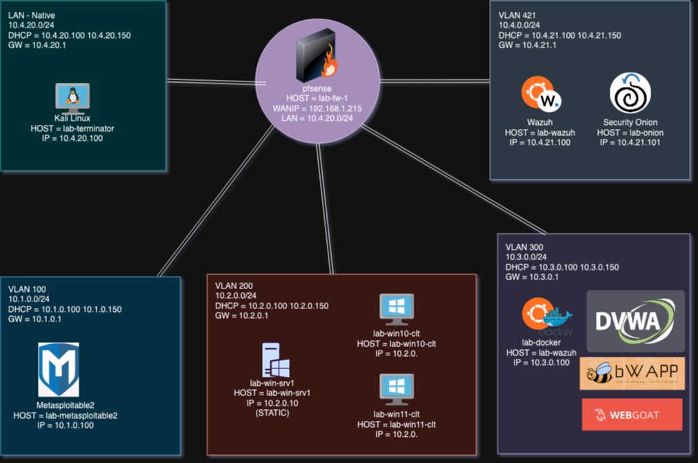

# hackbox-lab
### Shoutout to @gerardobrien 
A cyber security lab hosted in Proxmox VE

This lab will focus on building a cyber security lab using a proxmox host.

## Links

# Docker

https://docs.docker.com/engine/install/ubuntu/
https://docs.portainer.io/start/install-ce/server/docker/linux

# Docker Images

bwapp - https://hub.docker.com/r/raesene/bwapp
dvwa - https://hub.docker.com/r/vulnerables/web-dvwa/
webgoat - https://hub.docker.com/r/webgoat/webgoat

# Wazuh

https://documentation.wazuh.com/current/quickstart.html
https://documentation.wazuh.com/current/installation-guide/wazuh-agent/index.html
https://documentation.wazuh.com/current/user-manual/capabilities/container-security/monitoring-docker.html
https://github.com/gerardobrien/ultimate-cybersecurity-lab

# Nessus
https://www.tenable.com/downloads/nessus?loginAttempted=true

## To Do
- Documentation
  - README
  - Topology
  - Writeup
- Automation
  - VM deployment script
  - Ansible
